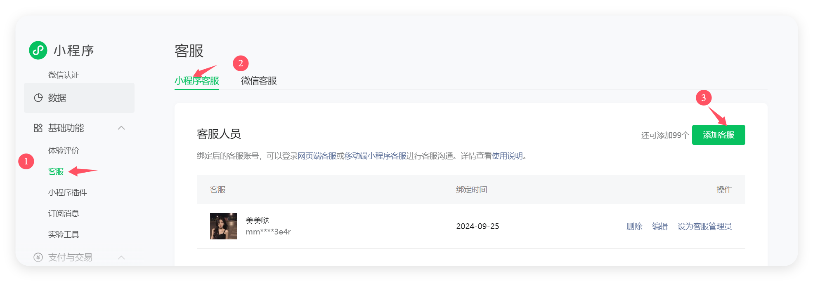

# 设置app打开微信客服

## 方式一：企业微信客服（APP端）

通过 `uni.share` API 调用企业微信客服功能：

```javascript
uni.share({
    provider: "weixin",
    openCustomerServiceChat: true,
    customerUrl: 'https://work.weixin.qq.com/kfid/*************', // 企业微信客服地址
    corpid: 'ww13edaa**********', // 企业微信 ID
    success: (res) => {
        console.log("客服调用成功:", JSON.stringify(res));
    },
    fail: (err) => {
        console.log("客服调用失败:", JSON.stringify(err));  
    }
});
```

### 参数说明

| 参数 | 类型 | 必填 | 说明 |
|------|------|------|------|
| provider | String | 是 | 固定值 "weixin" |
| openCustomerServiceChat | Boolean | 是 | 是否打开客服会话，固定值 true |
| customerUrl | String | 是 | 企业微信客服链接地址 |
| corpid | String | 是 | 企业微信的企业 ID |

---

## 方式二：小程序客服功能

### 1. 代码配置

在需要添加客服功能的页面中添加客服按钮：

```vue
<template>
  <button open-type="contact" class="contact-button">
    联系客服
  </button>
</template>

<style>
.contact-button {
  /* 自定义样式 */
  padding: 10px 20px;
  background-color: #07c160;
  color: white;
  border: none;
  border-radius: 4px;
}
</style>
```

### 2. 小程序后台配置

1. 登录微信小程序管理后台
2. 进入 **基础功能** → **客服**
3. 开通客服功能
4. 添加客服人员

### 3. 配置效果



完成以上配置后，用户在小程序中点击客服按钮，会自动弹出客服会话窗口。

---

## 注意事项

- **方式一**适用于 uni-app 开发的 APP 应用
- **方式二**仅适用于微信小程序环境
- 企业微信客服需要先在企业微信后台配置相关信息
- 小程序客服功能需要在微信小程序后台手动开通

---

## 参考资料

- [CSDN - uni-app实现微信客服功能](https://blog.csdn.net/ITyiy/article/details/139726658)
- [CSDN - 小程序客服配置详解](https://blog.csdn.net/weixin_45811884/article/details/139849549)
