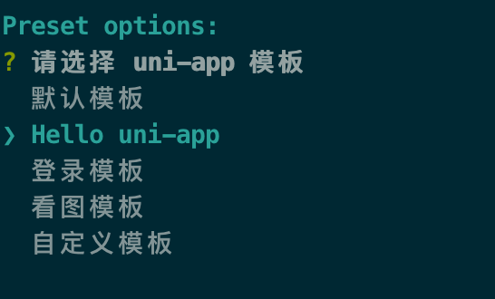

# uni-app Vue CLI 项目创建与配置完整指南


官网：https://uniapp.dcloud.net.cn/quickstart-cli.html

## 环境安装

```bash
# 全局安装Vue CLI
npm install -g @vue/cli
```

## 项目创建

### 使用正式版（对应HBuilderX最新正式版）

```bash
vue create -p dcloudio/uni-preset-vue my-project
```

### 使用alpha版（对应HBuilderX最新alpha版）

```bash
vue create -p dcloudio/uni-preset-vue#alpha my-alpha-project
```

### 使用Vue3/Vite版

**创建JavaScript工程**（如命令行创建失败，请直接访问[gitee](https://gitee.com/dcloud/uni-preset-vue/repository/archive/vite.zip)下载模板）

```bash
# 正式版本
npx degit dcloudio/uni-preset-vue#vite my-vue3-project

# alpha版本
npx degit dcloudio/uni-preset-vue#vite-alpha my-vue3-project
```

**创建TypeScript工程**（如命令行创建失败，请直接访问[gitee](https://gitee.com/dcloud/uni-preset-vue/repository/archive/vite-ts.zip)下载模板）

```bash
npx degit dcloudio/uni-preset-vue#vite-ts my-vue3-project
```

### 项目模板选择

创建项目时，会提示选择项目模板（使用Vue3/Vite版不会提示，目前只支持创建默认模板），初次体验建议选择 hello uni-app 项目模板。



## 重要注意事项

### Node版本要求
- Vue3/Vite版要求 node 版本 18+、20+
- HBuilderX Mac版本设置路径：菜单栏左上角 HBuilderX → 偏好设置 → 运行配置 → node路径
- HBuilderX Windows版本设置路径：菜单栏 工具 → 设置 → 运行配置 → node路径


### 依赖版本管理
- 模板下载的 `package.json` 中的版本一定要按默认的来，不要随意修改
- 修改时需要按照官方的升级方式进行，参考[更新依赖到指定版本](https://uniapp.dcloud.net.cn/quickstart-cli.html#cliversion)

### 常见编译器版本问题
由于vue-cli创建的项目编译器版本不跟随HBuilderX升级，需要用户手动升级。每次通过命令行启动项目时，会提示升级最新的编译器版本。

以下依赖不会自动更新，需要手动修改版本号：

```json
"devDependencies": {
    "@dcloudio/uni-automator": "3.0.0-alpha-4010520240507001",
    "@dcloudio/uni-cli-shared": "3.0.0-alpha-4010520240507001",
    "@dcloudio/uni-stacktracey": "3.0.0-alpha-4010520240507001",
    "@dcloudio/vite-plugin-uni": "3.0.0-alpha-4010520240507001"
}
```

## CSS预处理器配置（dart-sass）

### 安装依赖

```bash
npm install sass --save-dev
# 或者使用
yarn add sass --dev
```

### vite.config.ts中配置

```ts
import { defineConfig } from 'vite';
import sass from 'sass';

export default defineConfig({
  plugins: [],
  css: {
    preprocessorOptions: {
      scss: {
        additionalData: `@import "@/styles/variables.scss";`
      },
      sass: {
        implementation: sass
      }
    }
  }
});
```

### CSS预处理器说明

- `additionalData: @import "@/styles/variables.scss";` 中的 `@/` 对应 `src` 目录
- `uni.scss` 是特殊文件，代码中无需 import 即可在scss代码中使用样式变量
- vue-cli 创建的项目必须手动安装 `sass` 依赖，HBuilderX 内置包含 `sass` 插件会自动打包

## postcss + autoprefixer 实现自适应和自动添加前缀

- [实现自适应和自动添加前缀](./vue-cli-postcss.md)

## 相关参考

- [uni-app官方文档](https://uniapp.dcloud.net.cn/quickstart-cli.html)
- [node-sass升级dart-sass常见问题](https://uniapp.dcloud.net.cn/tutorial/migration-to-vue3.html#node-sass%E5%8D%87%E7%BA%A7dart-sass%E5%B8%B8%E8%A7%81%E9%97%AE%E9%A2%98%E5%8F%8A%E6%94%B9%E8%BF%9B%E6%96%B9%E6%B3%95)
- [sass预处理器](https://uniapp.dcloud.net.cn/tutorial/migration-to-vue3.html#sass%E9%A2%84%E5%A4%84%E7%90%86%E5%99%A8)
