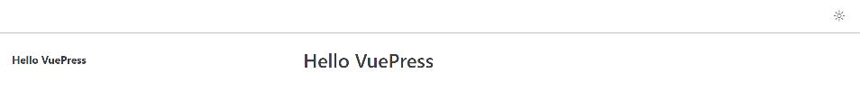
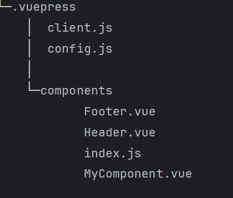

# VuePress 2.0 完整使用指南

## 简介

VuePress 是一个以 Markdown 为中心的静态网站生成器。你可以使用 Markdown 来书写内容（如文档、博客等），然后 VuePress 会帮助你生成一个静态网站来展示它们。

**本文档主要介绍 VuePress 2.0 版本**

### 相关链接

- **官网**: [https://vuepress.vuejs.org/zh/guide/introduction.html](https://vuepress.vuejs.org/zh/guide/introduction.html)
- **开源地址**: [https://github.com/vuepress/core](https://github.com/vuepress/core)
- **默认主题文档**: [https://ecosystem.vuejs.press/zh/themes/default/](https://ecosystem.vuejs.press/zh/themes/default/)
- **默认主题源码**: [https://github.com/vuepress/ecosystem/tree/main/themes/theme-default/src/client/components](https://github.com/vuepress/ecosystem/tree/main/themes/theme-default/src/client/components)
- **开源主题**: [https://marketplace.vuejs.press/zh/themes/docs.html](https://marketplace.vuejs.press/zh/themes/docs.html)

## 安装与配置

### 基础安装

参考官方教程：[https://vuepress.vuejs.org/zh/guide/getting-started.html](https://vuepress.vuejs.org/zh/guide/getting-started.html)

### 常见安装问题

按照官方手动安装教程可能会遇到以下错误：

```bash
[vite] Internal server error: Preprocessor dependency "sass-embedded" not found. 
Did you install it? Try `pnpm add -D sass-embedded`.
```

**解决方案：**
安装缺失的依赖包：

```bash
pnpm add -D sass-embedded
# 或者
pnpm add -D sass sass-loader
```

然后运行开发命令：

```bash
pnpm docs:dev
```

运行成功后显示效果如下：



### 项目依赖包示例

```json
{
  "name": "vuepress-project",
  "version": "1.0.0",
  "description": "A VuePress 2.0 project",
  "license": "MIT",
  "type": "module",
  "scripts": {
    "docs:build": "vuepress build docs",
    "docs:clean-dev": "vuepress dev docs --clean-cache",
    "docs:dev": "vuepress dev docs",
    "docs:update-package": "pnpm dlx vp-update"
  },
  "devDependencies": {
    "@vuepress/bundler-vite": "2.0.0-rc.18",
    "@vuepress/helper": "2.0.0-rc.60",
    "@vuepress/plugin-register-components": "2.0.0-rc.54",
    "@vuepress/plugin-search": "2.0.0-rc.55",
    "@vuepress/theme-default": "2.0.0-rc.60",
    "sass": "^1.81.0",
    "sass-loader": "^16.0.3",
    "vue": "^3.5.13",
    "vuepress": "2.0.0-rc.18"
  },
  "dependencies": {
    "markdown-it-copy": "^1.2.0"
  }
}
```

### 依赖包说明

- `@vuepress/bundler-vite`: VuePress 2.0 Vite 打包插件
- `@vuepress/helper`: 开发主题、覆盖主题组件时使用的工具插件
- `@vuepress/plugin-register-components`: 全局组件注册插件
- `@vuepress/plugin-search`: 搜索功能插件
- `@vuepress/theme-default`: VuePress 2.0 默认主题

## 版本迁移

### 从 v1 迁移到 v2

参考官方迁移指南：[https://vuepress.vuejs.org/zh/guide/migration.html](https://vuepress.vuejs.org/zh/guide/migration.html)

**重要说明：** v1 和 v2 版本差异较大，包括默认主题都是重新开发的。建议按照 v2 的方式重新开发项目。

## 全局组件注册

在 VuePress 2.0 中，`theme/global-components/` 和 `.vuepress/components` 目录下的文件不会被自动注册为全局 Vue 组件。

### 目录结构示例



### 方法一：使用插件自动注册

#### 1. 安装插件

```bash
pnpm add @vuepress/plugin-register-components@next -D
```

#### 2. 配置插件

创建 `docs/.vuepress/config.js`：

```javascript
import { viteBundler } from '@vuepress/bundler-vite'
import { defaultTheme } from '@vuepress/theme-default'
import { defineUserConfig } from 'vuepress'
import { registerComponentsPlugin } from '@vuepress/plugin-register-components'
import { getDirname, path } from 'vuepress/utils'

const __dirname = getDirname(import.meta.url)

export default defineUserConfig({
  bundler: viteBundler(),
  theme: defaultTheme(),
  plugins: [
    registerComponentsPlugin({
      componentsDir: path.resolve(__dirname, './components')
    })
  ]
})
```

配置完成后，`.vuepress/components` 目录下的所有组件可直接在 Markdown 文件中使用。

### 方法二：手动注册组件

#### 1. 创建客户端配置文件

在 `.vuepress/` 目录下创建 `client.js` 文件：

```javascript
import { defineClientConfig } from 'vuepress/client'
import MyComponent from './components/MyComponent.vue'

export default defineClientConfig({
  enhance({ app }) {
    // 手动注册全局组件
    app.component('MyComponent', MyComponent)
  }
})
```

#### 2. 批量注册组件（推荐）

在 `components` 目录下创建 `index.js`：

```javascript
// 引入自定义组件
import MyComponent from "./MyComponent.vue"
import Footer from "./Footer.vue"
import Header from "./Header.vue"

const CustomComponents = {
  Header,
  Footer
}

// 批量注册组件
export const installComponent = (app) => {
  if (Object.keys(CustomComponents).length > 0) {
    Object.keys(CustomComponents).forEach(key => {
      app.component(key, CustomComponents[key])
    })
  }
}

// 根节点全局组件
export const rootComponentsGlobal = [
  MyComponent
]
```

更新 `client.js`：

```javascript
import { defineClientConfig } from 'vuepress/client'
import { installComponent, rootComponentsGlobal } from "./components"

export default defineClientConfig({
  enhance({ app, router, siteData }) {
    // 注册自定义全局组件
    installComponent(app)
  },
  setup() {},
  rootComponents: rootComponentsGlobal
})
```

#### 3. 在 Markdown 中使用组件

```markdown
# 使用自定义组件

<Header/>
<MyComponent></MyComponent>
<Footer/>
```

## 搜索插件配置

### 官方文档

参考：[https://ecosystem.vuejs.press/zh/plugins/search/search.html](https://ecosystem.vuejs.press/zh/plugins/search/search.html)

### 基础配置

```javascript
import { searchPlugin } from '@vuepress/plugin-search'

export default defineUserConfig({
  // 动态设置页面标题
  extendsPage(page) {
    if (!page.frontmatter.title) {
      const match = page.content.match(/^##\s+(.+)/m)
      if (match) {
        page.title = match[1].trim()
      }
    }
  },
  plugins: [
    searchPlugin({
      // 搜索插件配置项
    })
  ]
})
```

### 配置说明

1. **动态标题提取**：`extendsPage` 方法用于动态设置网页标题。VuePress 2.0 默认从 h1 标题提取标题，如果 Markdown 文件没有一级标题，则提取不到标题。这个配置可以从二级标题（##）提取标题。

2. **搜索框位置自定义**：如果需要修改 `<SearchBox/>` 组件位置，需要自定义 `VPNavbar` 组件，需要安装额外的插件：

```bash
pnpm add @vuepress/helper@next -D
```

## 默认主题配置

### 导航栏配置

参考文档：[https://ecosystem.vuejs.press/zh/themes/default/config.html#navbar](https://ecosystem.vuejs.press/zh/themes/default/config.html#navbar)

### 侧边栏配置

参考文档：[https://ecosystem.vuejs.press/zh/themes/default/config.html#sidebar](https://ecosystem.vuejs.press/zh/themes/default/config.html#sidebar)

### 右侧小目录 二级目录 右侧锚点

参考文档：

[https://www.cnblogs.com/dingshaohua/p/16618802.html](https://www.cnblogs.com/dingshaohua/p/16618802.html)

https://github.com/dingshaohua-com/vuepress-plugin-anchor-right


### 组件替换

默认主题提供了替换单个组件的能力，参考：

- [https://ecosystem.vuejs.press/zh/themes/default/extending.html](https://ecosystem.vuejs.press/zh/themes/default/extending.html)

**重要提示**：在覆盖默认组件时，样式变量导入需要修改：

```scss
// 默认导入方式
@use '../styles/variables' as *;

// 覆盖组件时应使用
@use '@vuepress/theme-default/styles/variables' as *;
```

### 样式自定义

默认主题使用 SASS 作为 CSS 预处理器，可以通过以下文件自定义样式：

- **`.vuepress/styles/palette.scss`**: 自定义样式变量
- **`.vuepress/styles/index.scss`**: 添加额外的样式

详细文档：[https://ecosystem.vuejs.press/zh/themes/default/styles.html](https://ecosystem.vuejs.press/zh/themes/default/styles.html)

## 常见问题与解决方案

### 1. `page.frontmatter.layout ??= "NotFound"` 错误

**问题原因**：Node.js 版本过低（如 14.18.1）

**解决方案**：升级 Node.js 版本至 14.18.1 以上，推荐使用 20.10.1 或更高版本。

### 2. 样式预处理器错误

确保已安装必要的 SASS 依赖：

```bash
pnpm add -D sass sass-loader sass-embedded
```

### 3. 组件注册失败

检查以下几点：
- 确保已正确安装 `@vuepress/plugin-register-components` 插件
- 检查组件路径是否正确
- 确认 `client.js` 文件配置是否正确

## 参考资源

- [VuePress 避坑指南](https://mdnice.com/writing/dc41ed410a9f48028cb6a5ee48df3c5d)
- [官方生态系统文档](https://ecosystem.vuejs.press/zh/)
- [默认主题完整配置](https://ecosystem.vuejs.press/zh/themes/default/config.html)
