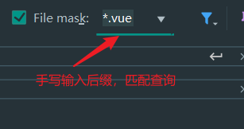
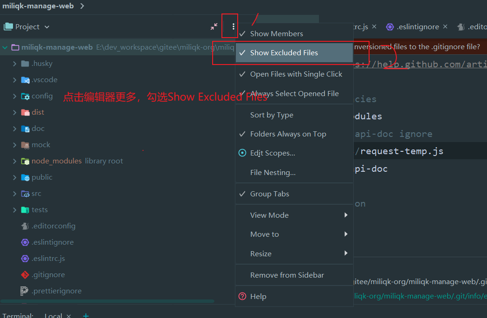
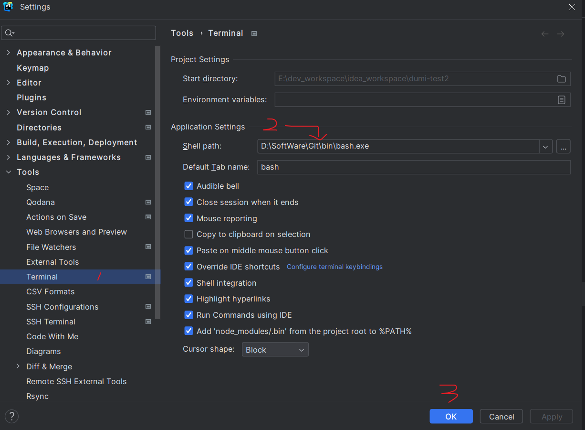
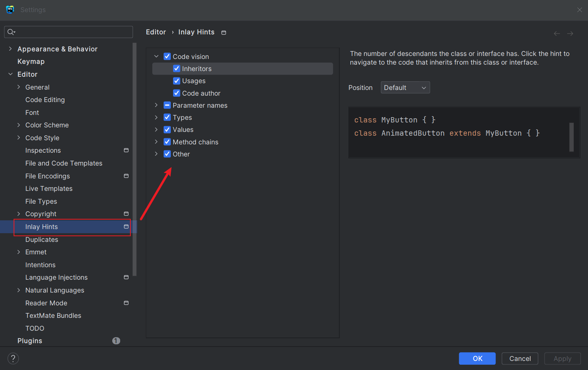
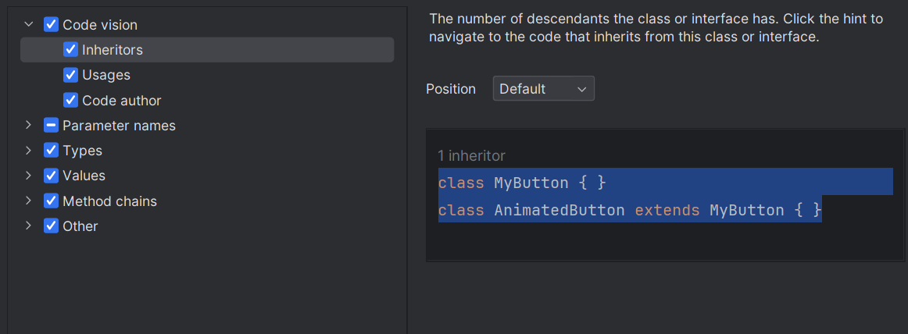
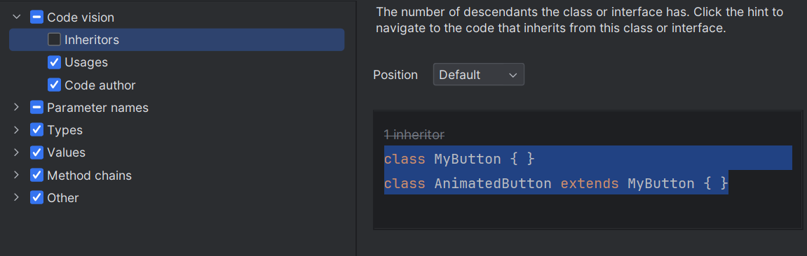

# WebStorm 使用指南

## 安装教程

### 官方下载
- 官网下载：https://www.jetbrains.com/webstorm/
- 官网下载其他版本：https://www.jetbrains.com/webstorm/download/other.html

### 网盘下载
网盘软件下载及激活说明：
- 链接：https://pan.baidu.com/s/1phuTf8US5RGXg0uVcoe3SA
- 提取码：5aqw

## 常见问题与解决方案

### 常用快速输入标签

参考文档：https://blog.csdn.net/qq_38712932/article/details/83031479

### webStorm 别名识别

为了让IDE（如VS Code）能够正确识别和跳转别名，可以在项目根目录创建 `jsconfig.json`：

```json
{
  "compilerOptions": {
    "baseUrl": ".",
    "paths": {
      "@/*": ["src/*"],
      "@components/*": ["src/components/*"],
      "@views/*": ["src/views/*"],
      "@assets/*": ["src/assets/*"]
    }
  }
}
```

### File mask 搜索技巧

File mask 后缀搜索是可以动态手写输入的，例如：下拉列表中没有`*.vue`，可以手写输入



### webStorm 右键新建File 找不到Vue 模板

**解决方案1：确认项目依赖**
可能当前项目不是vue项目，需要安装vue项目的相关依赖：

```json
"dependencies": {
  "core-js": "^3.6.5",
  "vue": "^2.6.11"
},
"devDependencies": {
  "@vue/cli-plugin-babel": "~4.5.15",
  "@vue/cli-plugin-eslint": "~4.5.15",
  "@vue/cli-service": "~4.5.15",
  "babel-eslint": "^10.1.0",
  "eslint": "^6.7.2",
  "eslint-plugin-vue": "^6.2.2",
  "vue-template-compiler": "^2.6.11",
  "@babel/core": "^7.21.4",
  "@babel/preset-env": "^7.21.4",
  "@dcloudio/types": "^3.2.11",
  "babel-jest": "^29.5.0"
}
```

**解决方案2：安装自定义模板**

```
settings -> plugins -> 安装模板
```

### webstorm node_modules 文件夹没有显示



### webStorm 配置Terminal bash命令行



### WebStorm新版本 tabs切换文件时，窗口自动切换到对应的文件


## WebStorm 2023新版本性能优化方案

### 禁用代码视觉提示优化CPU负载

**提示信息：** Disabling Code Vision hints may improve performance by reducing CPU load.
**中文意思：** 禁用代码视觉提示可以通过降低CPU负载来提高性能。

**设置位置：** File -> settings -> inlay Hints



#### Code vision（代码视觉）设置

**Inheritors 选项说明：**

打勾状态：



不打勾状态：



**说明：** 在 WebStorm 中，"inheritors" 选项是指在进行重构（如重命名变量或方法）时，是否同时修改其子类或实现的类。勾选 "inheritors" 选项将使重构操作同时更新相关的子类或实现的类，而不勾选则只更新当前类。

### 性能优化关键设置

#### 1. 禁用插件（⭐⭐⭐）
- **cucumber**：JavaScript测试类插件，不常用可以禁用

#### 2. 关闭代码检查（⭐⭐⭐）
**设置路径：** setting -> Editor -> Inspections

将右侧方框中的对勾根据需要取消勾选，建议保留以下两个核心检查项即可，其余可以根据项目需求进行调整。

**注意：** 完全关闭代码检查会影响代码质量提示，建议根据实际开发需求进行平衡调整。

## 总结

通过以上配置和优化，可以显著提升WebStorm的运行性能，特别是在处理大型项目时。建议根据自己的开发需求和机器性能，选择性地应用这些优化方案。