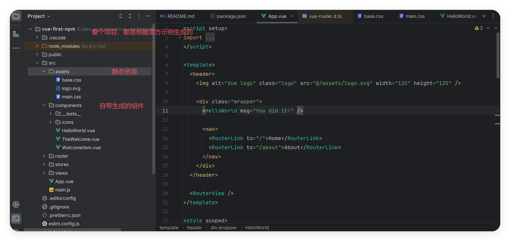
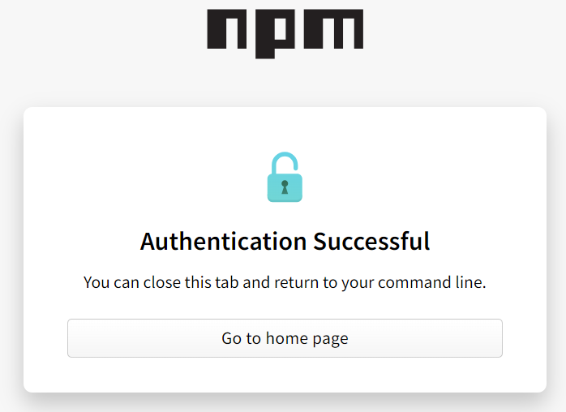
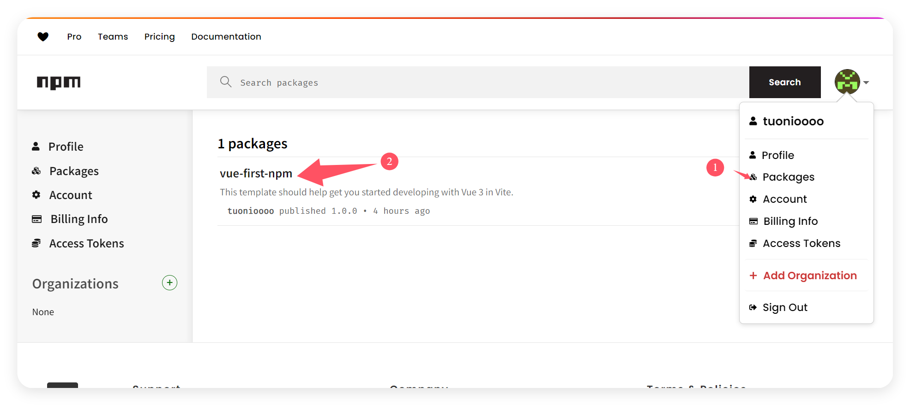

# Npm发包教程

### 什么是NPM？

NPM的全称是Node Package Manager，是一个NodeJS包管理和分发工具，已经成为了非官方的发布Node模块（包）的标准。

2020年3月17日，Github宣布收购npm，GitHub现在已经保证npm将永远免费，已提供了Pro专业版，可以无限制发布 共有包、私有包。

官网：<https://www.npmjs.com/>

### 如何发布一个自己的npm包？

#### 创建账号

在npm官网注册账号，绑定邮箱注册完后，验证一下邮箱即可完成，提供一个 `npm recovery codes` 恢复码
    
#### 创建一个 Vue 应用

参考Vue3官网：[快速上手](https://cn.vuejs.org/guide/quick-start.html)

完整示例：[vue-first-npm](https://github.com/tuonizhysg/vue-first-npm)

通过上面的示例，已经初始化完成了，假设你的工程名为：`vue-first-npm` （在发包前请检测一下是否存在）



package.json，中的 `private` 修改为 false
```json
{
    "name": "vue-first-npm",
    "version": "1.0.0",
    "private": false, 
    "type": "module",
    "scripts": {
    "dev": "vite",
    "build": "vite build",
    "preview": "vite preview",
    "test:unit": "vitest",
    "lint": "eslint . --fix",
    "format": "prettier --write src/"
    },
    "dependencies": {
    "pinia": "^2.2.6",
    "vue": "^3.5.12",
    "vue-router": "^4.4.5"
    },
    "devDependencies": {
    "@eslint/js": "^9.14.0",
    "@vitejs/plugin-vue": "^5.1.4",
    "@vitejs/plugin-vue-jsx": "^4.0.1",
    "@vitest/eslint-plugin": "1.1.7",
    "@vue/eslint-config-prettier": "^10.1.0",
    "@vue/test-utils": "^2.4.6",
    "eslint": "^9.14.0",
    "eslint-plugin-vue": "^9.30.0",
    "jsdom": "^25.0.1",
    "prettier": "^3.3.3",
    "vite": "^5.4.10",
    "vite-plugin-vue-devtools": "^7.5.4",
    "vitest": "^2.1.4"
    }
}
```
    
    

#### 第一次发布包时，需要登录账号

执行命令 `npm adduser`

```shell
npm adduser
npm notice Log in on http://registry.npm.taobao.org/
Username: yourname
Email: (this IS public) xxxx@xx.com
npm ERR! code E403
npm ERR! 403 403 Forbidden - PUT https://registry.npmmirror.com/-/user/org.couchdb.user:yourname - [FORBIDDEN] Public registration is not allowed
npm ERR! 403 In most cases, you or one of your dependencies are requesting
npm ERR! 403 a package version that is forbidden by your security policy, or
npm ERR! 403 on a server you do not have access to.
```
    
    

在添加登录账号时，可能会出现上面的错误，是由于添加了 淘宝镜像源导致的，因此在发布包的时候，需要切换回 `官方源` ，具体操作步骤如下：

* 查看当前配置镜像源

```bash
npm config list
; "user" config from C:\Users\Administrator\.npmrc

registry = "http://registry.npm.taobao.org"

; node bin location = D:\SoftWare\node-pro\nodejs\node.exe
; node version = v20.10.0
; npm local prefix = E:\dev_workspace\vue_workspace\vue-first-npm
; npm version = 10.2.3
; cwd = E:\dev_workspace\vue_workspace\vue-first-npm
; HOME = C:\Users\Administrator
; Run `npm config ls -l` to show all defaults.
```

* 修改为官方源

```shell
npm config set registry https://registry.npmjs.com/

#注意记得切换回回来
npm config set registry https://registry.npmmirror.com
```
    
* 再次登录
  
```bash
npm adduser
npm notice Log in on https://registry.npmjs.com/
Create your account at:
https://www.npmjs.com/login?next=/login/cli/13b6b267-9782-4ace-b852-675279c9fdd7
Press ENTER to open in the browser...
```

按回车键，会弹浏览器窗口让你登录，输入邮箱验证码后，点击login，显示`Authentication Successful`，



授权成功后，会在你的命令行中显示 `Logged in on https://registry.npmjs.com/.` ，此时已经完全登录。

```bash
npm adduser
npm notice Log in on https://registry.npmjs.com/
Create your account at:
https://www.npmjs.com/login?next=/login/cli/13b6b267-9782-4ace-b852-675279c9fdd7
Press ENTER to open in the browser...

**Logged in on https://registry.npmjs.com/.**
``` 
    

#### 正式发包

执行命令 `npm publish`

> 注意事项：
> 1.配置.gitignore 或.npmignore中，忽略不想上传的文件

#### 查询发布包

直接官网全局搜索，或者在自己的个人信息中查询



### 安装

和其他依赖包的安装方式一致。

```bash
npm install vue-first-npm
#或
pnpm add vue-first-npm
#或
yarn add vue-first-npm
```

局部引入方式:

```bash
# 引入组件
import HelloWorld from "vue-first-npm/src/components/HelloWorld.vue";
# 静态资源
import logo from "vue-first-npm/src/assets/logo.svg";
```

uni-app 框架下 配置 `easycom`

```json
"easycom": {
    // 采用了vue-cli 方式来安装 uv-ui
    "autoscan": true,
    "custom": {
        "^H(.*)": "vue-first-npm/src/components/H$1.vue", // 匹配node_modules内的vue文件
        "^T(.*)": "vue-first-npm/src/components/T$1.vue", // 匹配node_modules内的vue文件
        "^W(.*)": "vue-first-npm/src/components/W$1.vue"
    }
}
```

示例参考

[vuefirstnpm-simple](https://github.com/tuonizhysg/vuefirstnpm-simple)
    

### 如何**撤销发布**包

#### 撤销整个包

```bash
# 整个包将被从 NPM 注册表中移除。
npm unpublish vue-first-npm --force
npm WARN using --force Recommended protections disabled.
- vue-first-npm
```

#### 撤销指定版本的包

```bash
# 假设要撤销版本 1.0.1 的包 vue-first-npm，只会撤销指定的版本，其他版本仍然可用。
npm unpublish vue-first-npm@1.0.1
```

#### 注意事项

* 24 小时限制: 如果包的版本已经发布超过 24 小时，NPM 默认情况下不允许撤销。
* 对依赖的影响: 撤销包会影响使用该包的其他项目，尤其是团队协作或开源项目时应谨慎。
* 合法合规: 遵循 NPM 的包撤销政策。
* 需要权限: 只能由该包的维护者或具有发布权限的用户执行撤销操作。

### 常见错误

登录时，镜像源地址不对

```bash
npm ERR! code E403
npm ERR! 403 403 Forbidden - PUT https://registry.npmmirror.com/-/user/org.couchdb.user:yourname - [FORBIDDEN] Public registration is not allowed
npm ERR! 403 In most cases, you or one of your dependencies are requesting
npm ERR! 403 a package version that is forbidden by your security policy, or
npm ERR! 403 on a server you do not have access to.
```
