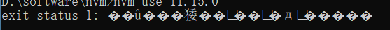

# nvm安装与使用

## 介绍

nvm全名node.js version management，顾名思义是一个nodejs的版本管理工具。通过它可以安装和切换不同版本的nodejs。

**参考:** https://t.1yb.co/FCL9
**下载:** https://github.com/coreybutler/nvm-windows/releases

* nvm-noinstall.zip：绿色免安装版，但使用时需进行配置。
* nvm-setup.zip：安装版，推荐使用

## 安装（略）

## 管理nodejs

查看本地安装的所有版本；有可选参数available，显示所有可下载的版本。

```shell
nvm list [available]
```

安装，命令中的版本号可自定义，具体参考命令1查询出来的列表

```shell
nvm install 11.13.0
```

使用特定版本（此种情况一般都是node版本与一些打包软件并不兼容时切换使用）

```shell
nvm use 11.13.0
```

卸载

```shell
nvm uninstall 11.13.0
```

## 命令提示

- nvm arch ：显示node是运行在32位还是64位。  
- nvm install <version\> \[arch\] ：安装node， version是特定版本也可以是最新稳定版本latest。可选参数arch指定安装32位还是64位版本，默认是系统位数。可以添加_\--insecure绕过远程服务器的SSL。_  
- nvm list \[available\] ：显示已安装的列表。可选参数available，显示可安装的所有版本。list可简化为ls。
- nvm on ：开启node.js版本管理。  
- nvm off ：关闭node.js版本管理。  
- nvm proxy \[url\] ：设置下载代理。不加可选参数url，显示当前代理。将url设置为none则移除代理。  
- nvm node\_mirror \[url\] ：设置node镜像。默认是<https://nodejs.org/dist/>。如果不写url，则使用默认url。设置后可至安装目录settings.txt文件查看，也可直接在该文件操作。  
- nvm npm\_mirror \[url\] ：设置npm镜像。<https://github.com/npm/cli/>archive/。如果不写url，则使用默认url。设置后可至安装目录settings.txt文件查看，也可直接在该文件操作。  
- nvm uninstall <version\> ：卸载指定版本node。  
- nvm use \[version\] \[arch\] ：使用制定版本node。可指定32/64位。  
- nvm root \[path\] ：设置存储不同版本node的目录。如果未设置，默认使用当 前目录。  
- nvm version ：显示nvm版本。version可简化为v。  

## 相关示例

```bash
nvm version            // 查看nvm版本
nvm install  4.6.2       // 安装node4.6.2版本（附带安装npm）
nvm uninstall   4.6.2      // 卸载node4.6.2版本
nvm list              // 查看node版本
nvm use 4.6.2       // 将node版本切换到4.6.2版本
nvm root　　　　 // 查看nvm安装路径
nvm install     latest       //下载最新的node版本和与之对应的npm版本
```

## nvm配置淘宝镜像

在 settings.txt 文件中最后一行添加如下两行配置

```
root: D:\SoftWare\node-pro\nvm
path: D:\SoftWare\node-pro\nodejs
node_mirror: https://npmmirror.com/mirrors/node/
npm_mirror: https://npmmirror.com/mirrors/npm/
```

保存后，即可

## 常见问题以及解决方式

1.乱码问题

**解决方式：权限问题，即使用管理员方式打开cmd窗口。推荐Windows PowerShell 通常是这种情况导致的。**

2.本节列出node.js版本管理工具nvm的安装及使用，需要注意的是安装路径最好不要出现中文和空格。否则会出现 nvm use 版本号乱码问题


node的安装路径有中文或者空格，在nvm的文件夹内修改setting.txt文件


第一行为nvm安装路径，第二行为node安装路径

**node与npm版本对应关系以及使用nvm管理node版本**

<https://blog.csdn.net/weixin_43025151/article/details/125513578>

3.nvm install 18.19.1时 如下报错 Could not retrieve [npm.taobao.org/mirrors/nod…](https://link.juejin.cn/?target=https%3A%2F%2Fnpm.taobao.org%2Fmirrors%2Fnode%2Flatest-v16%2FSHASUMS25.txt)

是因为，淘宝的镜像源换了

将旧的镜像源

```bash
root: D:/SoftWare/node-pro/nvm
path: D:/SoftWare/node-pro/nodejs
node_mirror: https://npm.taobao.org/mirrors/node/
npm_mirror: https://npm.taobao.org/mirrors/npm/
```

更换为即可

```bash
root: D:/SoftWare/node-pro/nvm
path: D:/SoftWare/node-pro/nodejs
node_mirror: https://npmmirror.com/mirrors/node/
npm_mirror: https://npmmirror.com/mirrors/npm/
```
